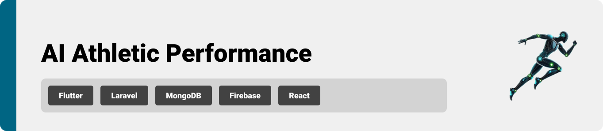

<br><br>

<!-- project philosophy -->
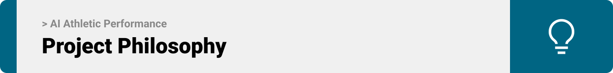


AI Athletic Performance helps athletes detect and fix their running technique, give accurate photo finish timing, and predict future results for upcoming competitions.

### User Stories
* As an Athlete,
   - I want real-time feedback on my exercises, so I can correct my form and avoid injuries.

   - I want progress reports that show my performance improvements, so I can stay motivated and adjust my goals.

   - I want to get an accurate prediction of my performance, so I can know my abilities before any compitition.

* As an Admin,
   - I want to see all things going on on my app, so I can have a detailed analysis of what features athletes are mostly.

   - I want to know what age category is this app is aimed to, so I can know what user interface I would be using.
   - I want to know kind of athletes this app is aimed to, sprinters, long distance runners or jumpers, so I can add features as it suites the audience.
=======

<br><br>
<!-- Tech stack -->


###  AI Athletic Performance is built using the following technologies:

- This project uses the [Flutter app development framework](https://flutter.dev/) while using GetX for state managements. Flutter is a cross-platform hybrid app development platform which allows us to use a single codebase for apps on mobile, desktop, and the web.
- For the backend, the app uses the [Laravel framework](https://laravel.com/). Laravel uses MVC design pattern and give a very clean code.
- For AI features, the app uses [Flask/Python] as a backend to create APIs suitable for such features.
- For persistent storage (database), the app uses the [MySQL](https://www.mysql.com/) package which allows the app to create a custom storage schema and save it to a local database.
- For the dashboard, the frontend is made of pure [React](https://react.dev/), and it's deployed online.


<br><br>
<!-- UI UX -->


> We designed AI Athletic Performance wireframes and mockups, iterating on the design until we reached the ideal layout for easy navigation and a seamless user experience.

- Project Figma design [figma]([https://www.figma.com/design/KAZsRwNccV60g4ig9fojpF/Untitled?node-id=0-1&p=f&t=HqztjbhyQaemDIN0-0])


### Mockups 
| AI ChatBot Screen | Detect screen | Main Screen |
| ---| ---| ---|
| 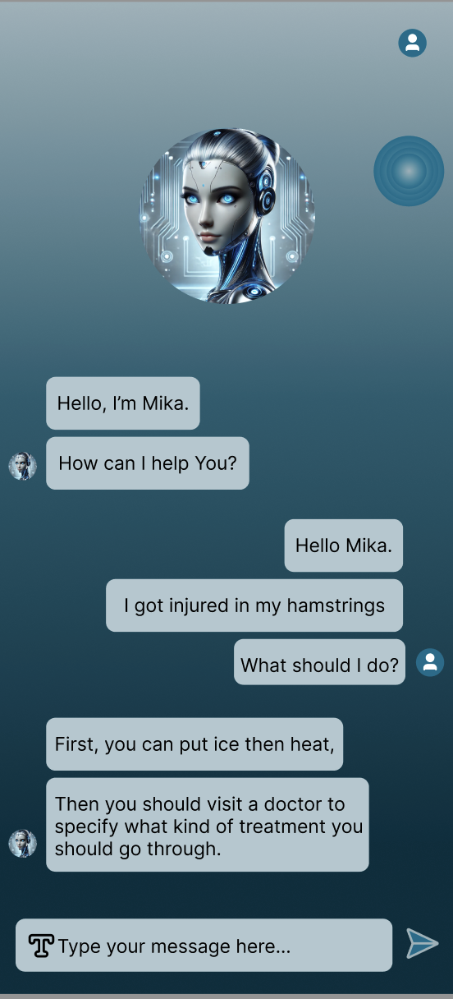 | 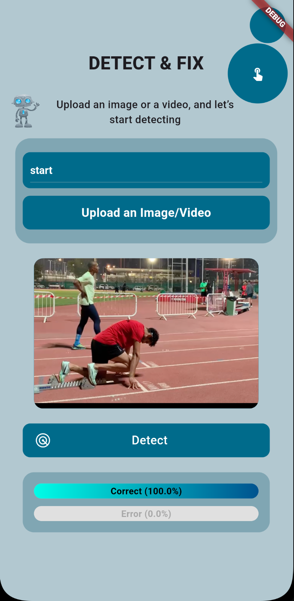 |  |

<br><br>

<!-- Database Design -->


###  Architecting Data Excellence: Innovative Database Design Strategies:

- Insert ER Diagram here


<br><br>


<!-- Implementation -->


### User Screens (Mobile)
| Detect screen  | Photo Finish screen | Predict screen 
| ---| ---| ---|
| 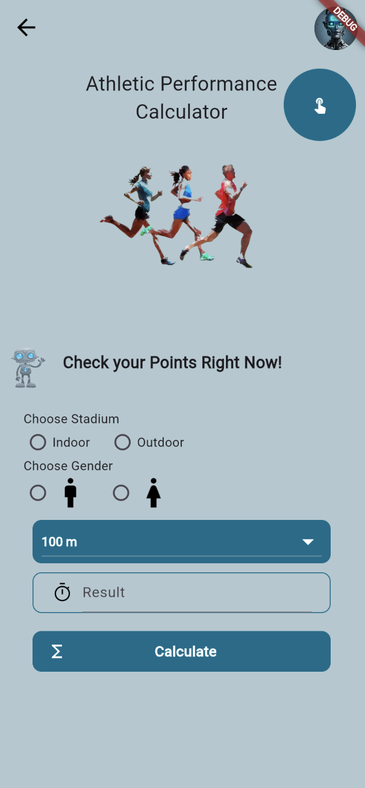 | 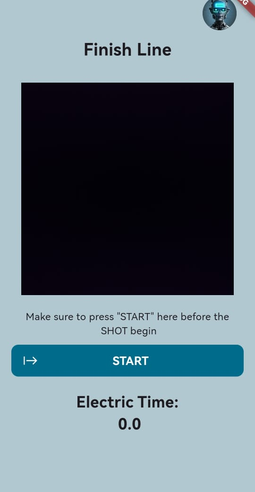 | 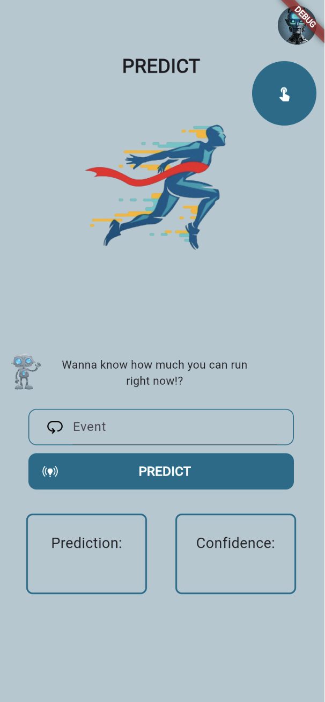 |
| Detect screen  | OnBoarding Screen | Photo Finish Screen |
| ---| ---| ---|
| 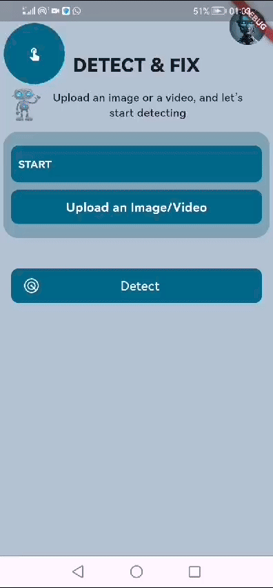 | 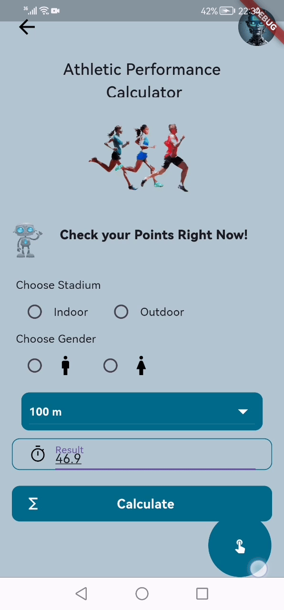 | 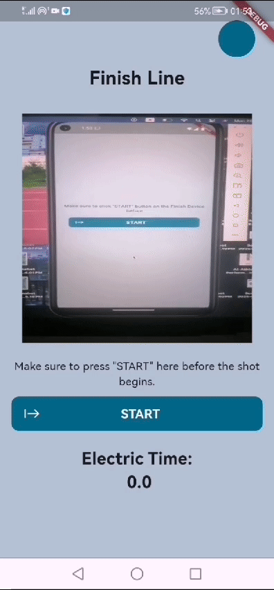 | 
| Validate screen  | Detect Screen | Generate Screen |
| ---| ---| ---|
| 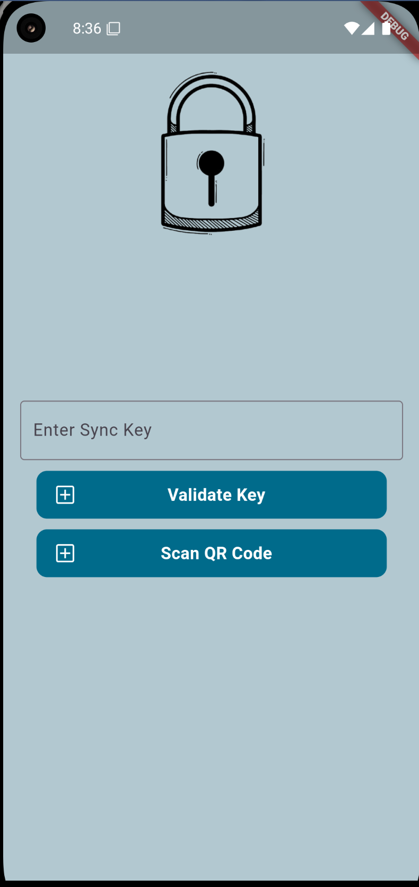 | 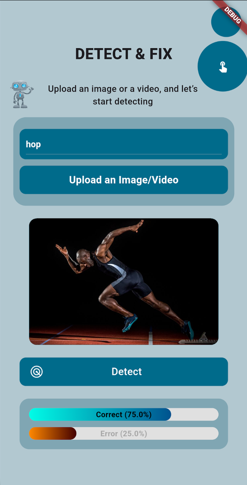 | 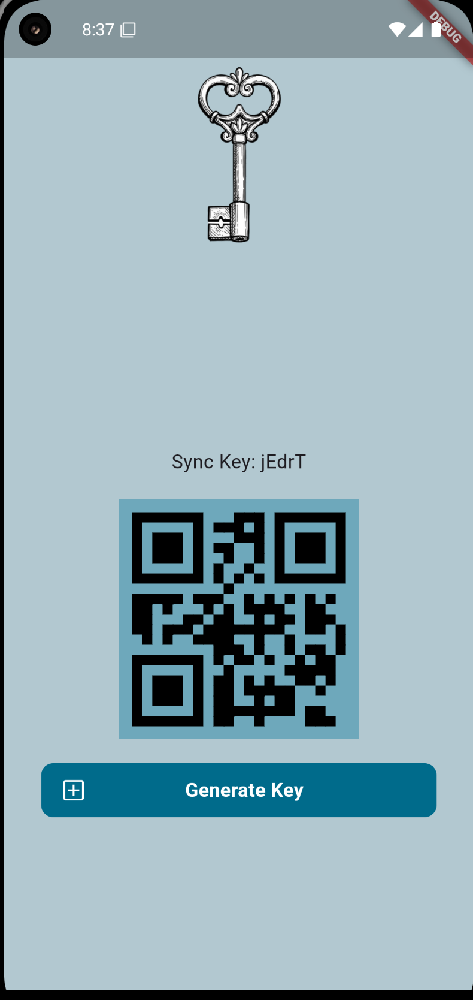 |


### Admin Screens (Web)
| Dashboard Screen  |
| ---|
| 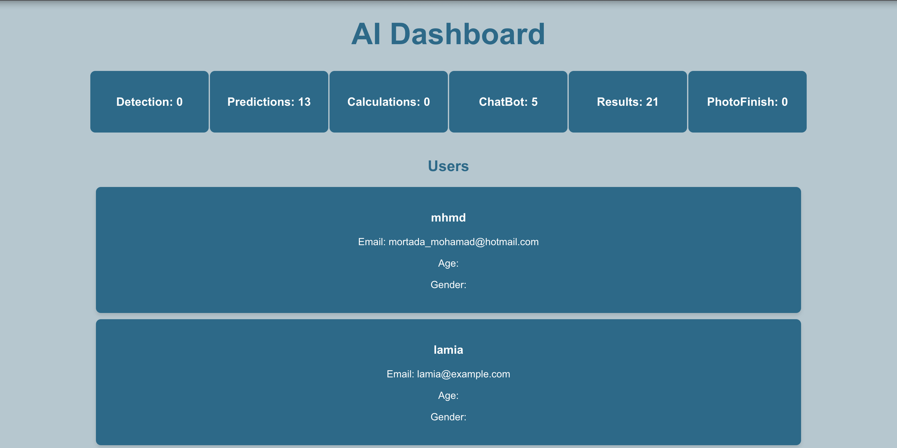 |

<br><br>


<!-- Prompt Engineering -->
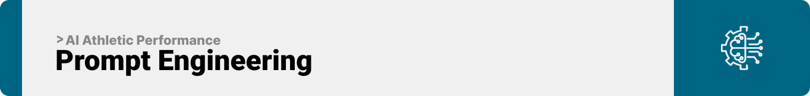

###  Mastering AI Interaction: Unveiling the Power of Prompt Engineering:

- This project uses Mediapipe(https://mediapipe-studio.webapps.google.com/studio/demo/pose_landmarker) and OpenCV(https://opencv.org/) to analyze athletes' movements and detect their performance in real time and to give accurate photo finish timing. It also integrates OpenAI(https://openai.com/index/openai-api/) to provide smart predictions and feedback, helping athletes improve their running technique, get accurate timing, and plan for future competitions.

| Getting into a human body detection  |
| --- |
| 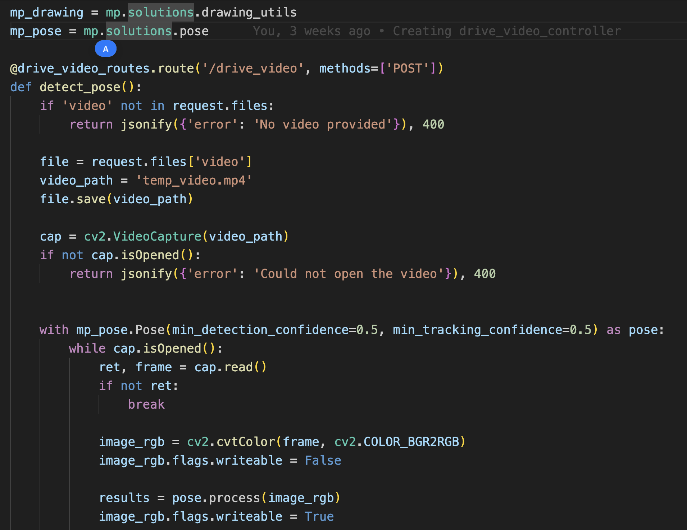 |

<br><br>

<!-- AWS Deployment -->
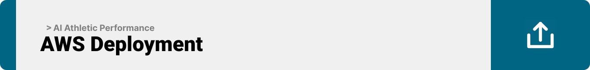

- This project is deployed on AWS to make it accessible and reliable for users. AWS provides a secure and fast platform, ensuring the app runs smoothly. It was deployed using [EC2 Instance] for easy management and monitoring.

| Register screen  | Login Screen |
| ---| ---|
| 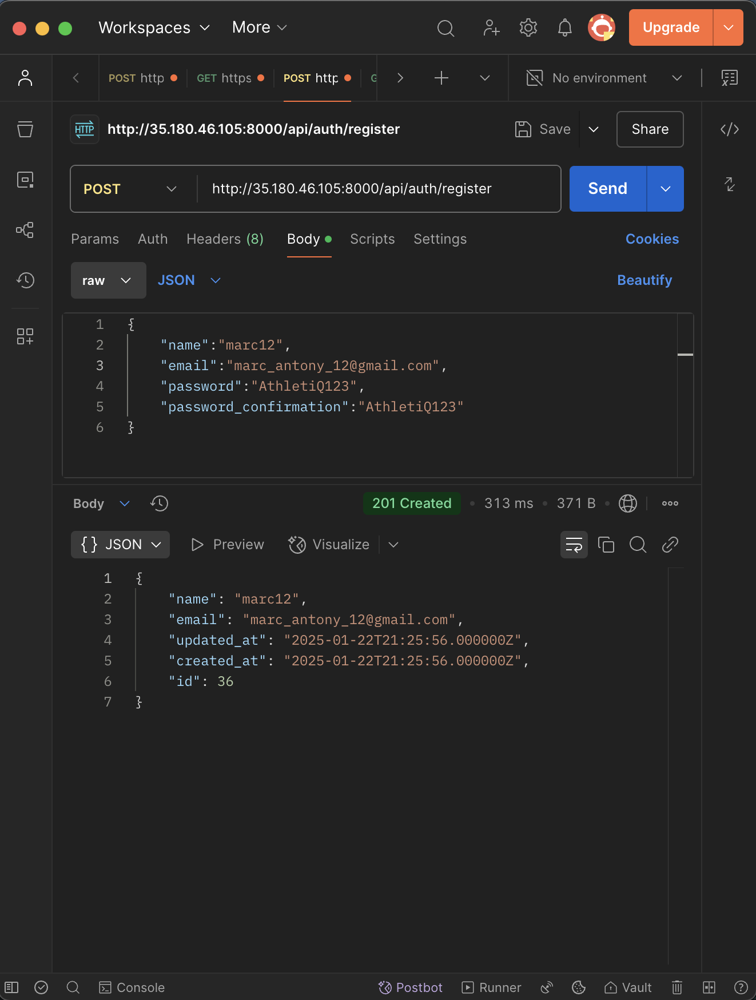 | 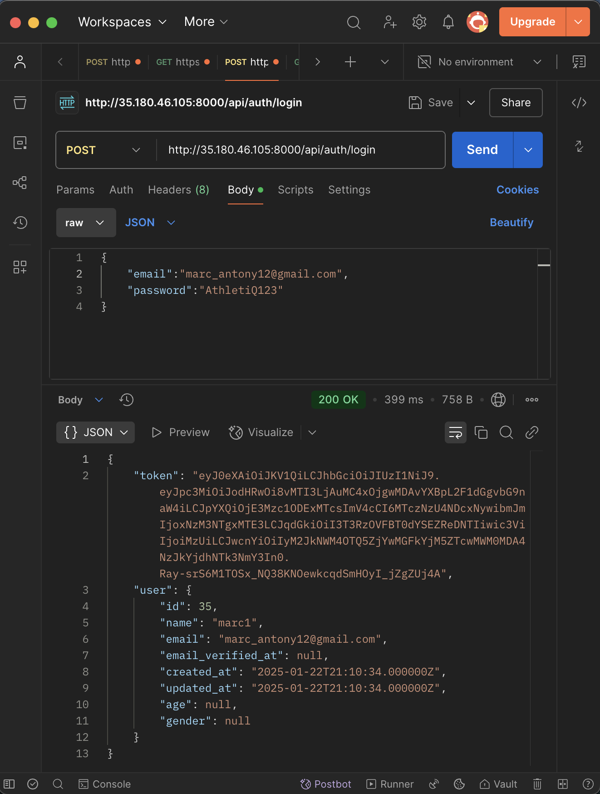 | 
| ---| ---|
| Generate Key screen  | Get Users Screen |
| 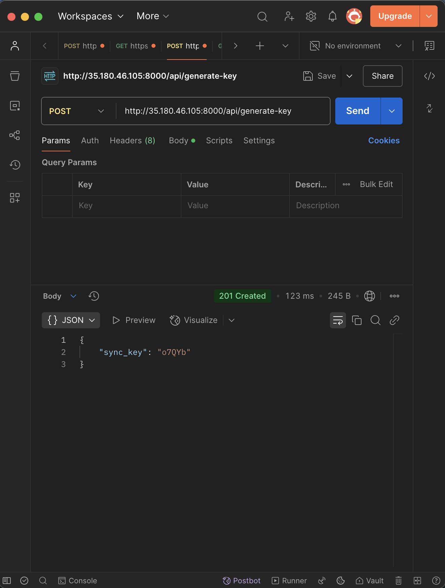 | 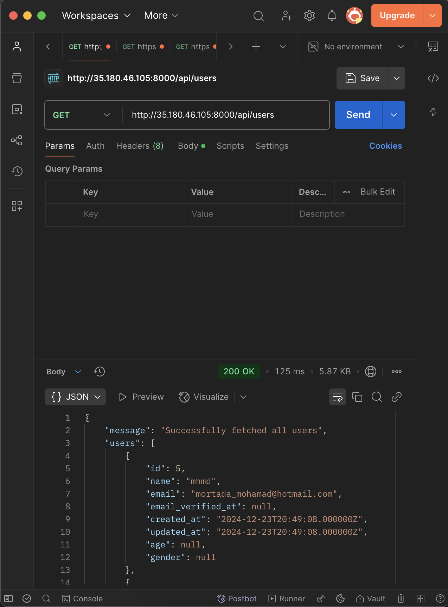 | 

<br><br>

<!-- How to run -->


> To set up AI Athletic Performance locally, follow these steps:

### Prerequisites

Follow these steps:
* git clone https://github.com/MohamaddMortada/AI-Athletic-Performance.git
* Flutter APP:
   ```sh
   cd front_end
   ```
   ```sh
   flutter pub get
   ```
   ```sh
   flutter run
   ```
* React Dashboard:
   ```sh
   cd ../AIDashBoard
   ```
   ```sh
   npm install npm@latest -g
   ```
   ```sh
   npm i axios
   ```
   ```sh
   npm start
   ```
* Laravel Backend:
   ```sh
   cd ../AIBackEnd
   ```
   ```sh
   php install
   ```
   ```sh
   composer install
   ```
   ```sh
   mysql install
   ```
   ```sh
   php artisan migrate
   ```
   ```sh
   php artisan serve
   ```
* Python Backend:
   ```sh
   cd ../PythonBackEnd
   ```
   ```sh
   pip install -r requirements.txt
   ```
   ```sh
   python app.py
   ```

### Installation

_Below is an example of how you can instruct your audience on installing and setting up your app. This template doesn't rely on any external dependencies or services._

1. Get an API Key at [https://platform.openai.com/api-keys]
2. Clone the repo
   git clone [github](https://github.com/MohamaddMortada/AI-Athletic-Performance.git)
3. Check Prerequisites.
4. Enter your API in `.env`
   ```sh
   API_KEY = YOUR-API-KEY
   ```

Now, you should be able to run AI ATHLETIC PERFORMANCE locally and explore its features.
